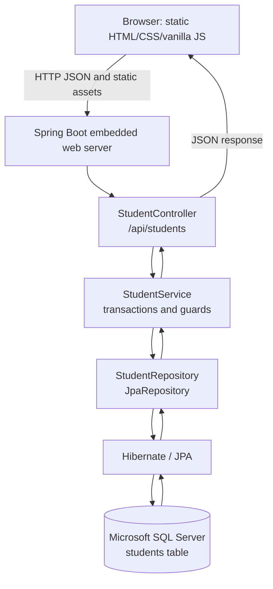
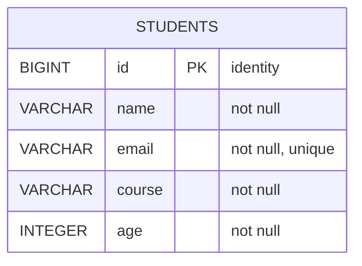
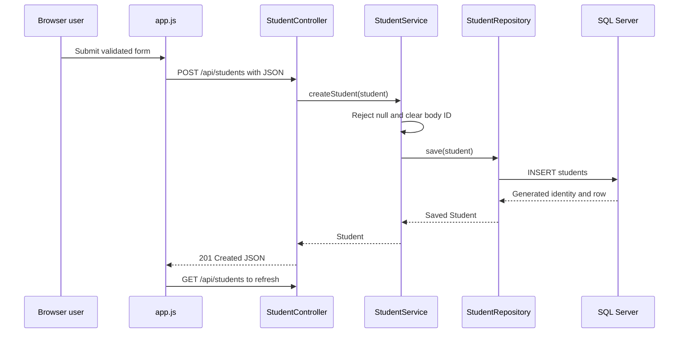

# Student Management System: Application Architecture

## Evidence Boundary

This document describes the code and configuration present in this repository on the `develop` branch. It does not infer infrastructure, endpoints, database objects, or product behavior that are not represented in the source. Generated Maven output under `target/` is not treated as source of truth. Sensitive values from local configuration are intentionally redacted.

## 1. Project Overview


### Simple description

This is a small student-record management application. A browser loads a static dashboard from the Spring Boot server, retrieves student records through a REST API, and lets a user list, create, edit, view, filter, sort, export, and delete records. The records are persisted through JPA to Microsoft SQL Server at runtime.

### Technical description

The application is a Maven-based Java 17 / Spring Boot 3.3.0 application. Spring MVC exposes CRUD endpoints under `/api/students`; `StudentService` owns transaction boundaries and small guard rules; Spring Data JPA provides persistence through `StudentRepository`; and `Student` maps to the `students` table. The UI is static HTML, CSS, and vanilla JavaScript served from `src/main/resources/static` by the embedded Spring Boot web server.

| Area                  | Confirmed implementation                                                                                                                            |
| --------------------- | --------------------------------------------------------------------------------------------------------------------------------------------------- |
| Application name      | `StudentManagement` in base configuration; display name is Student Management System / EduManager                                                   |
| Purpose               | Manage CRUD student records containing name, email, course, and age                                                                                 |
| Current functionality | REST CRUD, dashboard rendering, client search/filter/sort/pagination, CSV export, single and bulk deletion, add/edit/view modals, theme persistence |
| Target users          | No formal user roles or audience definition exists in code. The UI is a browser-facing student directory.                                           |
| Development status    | Runnable learning/practice application with automated backend tests; no production deployment implementation is present.                            |
| Backend               | Java, Spring Boot, Spring MVC, Spring Data JPA, Hibernate via Boot, embedded Tomcat                                                                 |
| Runtime database      | Microsoft SQL Server via the Microsoft JDBC driver                                                                                                  |
| Test database         | H2 in-memory database for the repository integration slice                                                                                          |
| External services     | None called by application code. The HTML references Google Fonts as a browser-side external resource.                                              |
| Build                 | Maven Wrapper and `spring-boot-maven-plugin`                                                                                                        |
| Tests                 | JUnit 5 through `spring-boot-starter-test`, Mockito, MockMvc, Spring Boot test slices, H2                                                           |

## 2. Complete Technology Stack

| Technology                   | Present use                                                                                    | Where                                                        |
| ---------------------------- | ---------------------------------------------------------------------------------------------- | ------------------------------------------------------------ |
| Java 17                      | Application and test language; compiler source/target are 17                                   | `pom.xml`, `src/main/java`, `src/test/java`                  |
| Spring Boot 3.3.0            | Application bootstrap and auto-configuration                                                   | Parent POM and `StudentManagementApplication`                |
| Spring Boot Web / Spring MVC | REST routing, JSON request binding, embedded web server                                        | `StudentController`, `spring-boot-starter-web`               |
| Spring Boot Actuator         | Actuator dependency is declared                                                                | `pom.xml`; no custom actuator configuration is present       |
| Spring Data JPA              | Repository abstraction and CRUD persistence                                                    | `StudentRepository`, `spring-boot-starter-data-jpa`          |
| Hibernate ORM                | JPA implementation and schema/database interaction through Spring Boot                         | JPA starter and entity mapping                               |
| Jakarta Persistence          | Entity, table, column, ID, and generated-key annotations                                       | `Student.java`                                               |
| Microsoft SQL Server JDBC    | Runtime JDBC driver for SQL Server                                                             | `mssql-jdbc` runtime dependency and datasource configuration |
| H2                           | In-memory database for JPA integration tests                                                   | Test dependency and `application-test.properties`            |
| Jackson                      | JSON serialization/deserialization through Spring MVC                                          | `ObjectMapper` in controller tests and REST binding          |
| Apache Maven                 | Dependency management, compilation, tests, packaging, and run lifecycle                        | `pom.xml`, `mvnw`, `mvnw.cmd`                                |
| Spring Boot Maven Plugin     | Spring Boot run and executable JAR packaging                                                   | `pom.xml`                                                    |
| JavaScript (vanilla)         | Browser state, fetch calls, rendering, validation, modals, CSV export                          | `src/main/resources/static/app.js`                           |
| HTML5                        | Dashboard structure and forms                                                                  | `static/index.html`                                          |
| CSS3                         | Design tokens, light/dark themes, layout, responsive behavior, animations                      | `static/style.css`                                           |
| Google Fonts                 | Browser-side font loading for Inter and JetBrains Mono                                         | `<link>` tags in `static/index.html`                         |
| JUnit 5                      | Unit and integration test framework                                                            | Test classes via `spring-boot-starter-test`                  |
| Mockito                      | Mocking service/repository collaborators                                                       | `StudentControllerTest`, `StudentServiceTest`                |
| MockMvc                      | Controller HTTP-slice testing                                                                  | `StudentControllerTest`                                      |
| Spring Boot test slices      | Context smoke test, MVC slice, and JPA slice                                                   | `@SpringBootTest`, `@WebMvcTest`, `@DataJpaTest`             |
| AssertJ                      | Included transitively by Spring Boot test starter; no direct use was found in inspected tests  | `pom.xml` dependency graph                                   |
| Logging                      | Spring Boot default logging is inherited; application code uses browser `console` logging only | No custom logging configuration is present                   |

Not present in the project: a frontend framework, npm/package configuration, UI component library, CSS preprocessor, authentication library, authorization model, API specification generator, migration tool, cache, message broker, Dockerfile, Kubernetes manifest, CI workflow, or cloud SDK.

## 3. Project Directory Structure

```text
SpringBootPractice/
├── APPLICATION_ARCHITECTURE.md
├── pom.xml
├── mvnw
├── mvnw.cmd
├── .mvn/
│   └── wrapper/
│       └── maven-wrapper.properties
├── .gitignore
├── README.md
├── .github/
│   └── modernize/
│       └── java-upgrade/       # Repository modernization metadata, not deployment code
└── src/
    ├── main/
    │   ├── java/com/example/
    │   │   ├── StudentManagementApplication.java
    │   │   ├── controller/StudentController.java
    │   │   ├── model/Student.java
    │   │   ├── repository/StudentRepository.java
    │   │   └── service/StudentService.java
    │   └── resources/
    │       ├── application.properties
    │       ├── application-dev.properties  # Ignored local profile file; not a deployable template
    │       └── static/
    │           ├── index.html
    │           ├── app.js
    │           └── style.css
    └── test/
        ├── java/com/example/
        │   ├── StudentManagementApplicationTests.java
        │   ├── controller/StudentControllerTest.java
        │   ├── model/StudentTest.java
        │   ├── repository/StudentRepositoryIntegrationTest.java
        │   └── service/StudentServiceTest.java
        └── resources/application-test.properties
```

`target/` contains generated classes, JAR output, Maven status, and Surefire reports. It is ignored and should not be modified as source. `.gitignore` also ignores local profile properties and IDE files. The `application-dev.properties` file exists in this workspace but is excluded from Git.

## 4. High-Level Architecture



- **Bootstrap/server:** `StudentManagementApplication` is annotated with `@SpringBootApplication`, so component scanning starts at `com.example` and Spring Boot auto-configures the web and JPA infrastructure.
- **Presentation/API:** `StudentController` maps HTTP requests, delegates to the service, and creates success/not-found responses.
- **Application/service:** `StudentService` is a Spring `@Service`, provides read-only class-level transactions and write-method transactions, enforces null/path-ID guards, and delegates persistence.
- **Persistence:** `StudentRepository` is a Spring Data interface. Its proxy supplies standard CRUD methods; no custom SQL or query method is declared.
- **Model/database mapping:** `Student` is both the JSON payload shape and the JPA entity mapped to `students`.
- **Client:** static JavaScript calls the same-origin API and maintains all view state in memory. Search, filtering, sorting, pagination, statistics, and CSV generation are client-side.

## 5. Request / Response Flow

Example: `GET /api/students/1`

1. The browser calls `fetch('/api/students/1')` only through the UI's general data-loading path; the static page itself initially calls `GET /api/students` and then renders records locally.
2. Spring MVC matches `/api/students/{id}` in `StudentController` and converts the path segment to `Long`.
3. The controller calls `studentService.getStudentById(1L)`.
4. The service rejects only a `null` ID locally; for `1L` it calls `studentRepository.findById(1L)`.
5. Spring Data JPA/Hibernate executes the generated primary-key lookup against `students`.
6. If present, the service returns `Optional<Student>` and the controller returns `200 OK` with the entity serialized as JSON.
7. If absent, the controller returns `404 Not Found` with `{"message":"Student not found with ID: 1"}`.
8. A non-numeric path value cannot be converted to `Long`; Spring MVC returns `400 Bad Request` through its default handling.

For the initial dashboard load, `app.js` fetches the entire collection, computes client-side statistics and filters, and renders either desktop table rows or mobile cards.

## 6. Backend Architecture and API

### Controller

`StudentController` is a constructor-injected `@RestController` with base path `/api/students`. It depends only on `StudentService`. Collection GET and POST mappings accept both `/api/students` and `/api/students/`.

| Method | Endpoint                            | Purpose                        | Request                                    | Response                                    | Status                                                       |
| ------ | ----------------------------------- | ------------------------------ | ------------------------------------------ | ------------------------------------------- | ------------------------------------------------------------ |
| GET    | `/api/students` or `/api/students/` | Retrieve all students          | No body or parameters                      | JSON array of `Student`                     | `200 OK`                                                     |
| GET    | `/api/students/{id}`                | Retrieve one student           | `id` path variable converted to `Long`     | Student JSON, or `{"message":...}`          | `200`, `404`; conversion failure is `400`                    |
| POST   | `/api/students` or `/api/students/` | Create a student               | JSON `Student` body                        | Created Student JSON                        | `201 Created`; malformed/empty JSON is `400`                 |
| PUT    | `/api/students/{id}`                | Replace/update a student by ID | `id` path variable and JSON `Student` body | Updated Student JSON, or `{"message":...}`  | `200`, `404`; malformed/empty body or ID conversion is `400` |
| DELETE | `/api/students/{id}`                | Delete one student             | `id` path variable                         | Empty body on success, or `{"message":...}` | `204`, `404`; ID conversion is `400`                         |

The controller has no explicit `@Valid`, response DTO, `@ExceptionHandler`, `@ControllerAdvice`, CORS mapping, or authentication annotation. Runtime exceptions from the service are not translated by application code.

### JSON shape

The API uses the `Student` entity directly. A typical create request is:

```json
{
  "name": "Ada Lovelace",
  "email": "ada@example.com",
  "course": "Mathematics",
  "age": 28
}
```

A successful response includes the generated `id`:

```json
{
  "id": 1,
  "name": "Ada Lovelace",
  "email": "ada@example.com",
  "course": "Mathematics",
  "age": 28
}
```

## 7. Service Layer

`StudentService` is the only service. It has a constructor-injected `StudentRepository` dependency and is annotated `@Transactional(readOnly = true)` at class level.

| Method                                                          | Behavior                                                                                                                                                             |
| --------------------------------------------------------------- | -------------------------------------------------------------------------------------------------------------------------------------------------------------------- |
| `List<Student> getAllStudents()`                                | Calls `findAll()` and converts a theoretically null repository result to `Collections.emptyList()`. Spring Data normally returns an empty list rather than null.     |
| `Optional<Student> getStudentById(Long id)`                     | Returns empty without querying when `id == null`; otherwise delegates to `findById`. Zero and negative IDs are passed through.                                       |
| `Student createStudent(Student student)`                        | Throws `IllegalArgumentException` for a null payload, clears any incoming ID, then calls `save`. The database generates the ID.                                      |
| `Optional<Student> updateStudent(Long id, Student updatedData)` | Returns empty for null ID, null body, or a missing repository ID. It overwrites the body ID with the path ID, saves the supplied object, and wraps the saved result. |
| `boolean deleteStudent(Long id)`                                | Returns false for null/missing IDs; otherwise calls `deleteById` and returns true.                                                                                   |

Write methods are individually annotated `@Transactional`, overriding the class read-only default. No domain validation, duplicate-email pre-check, DTO mapping, exception translation, or partial-update semantics are implemented. Repository exceptions, including data-integrity errors, propagate to the caller.

## 8. Repository and Data Access

`StudentRepository` is a `@Repository` interface extending `JpaRepository<Student, Long>`. Spring Data generates the implementation and standard operations, including `findAll`, `findById`, `save`, `deleteById`, `existsById`, `deleteAll`, `flush`, and related inherited methods.

There are no custom query methods, JPQL queries, native SQL queries, specifications, projections, relationships, or repository-level indexes declared in Java. The service uses `findAll`, `findById`, `existsById`, `save`, and `deleteById`. Update and delete first perform an existence check, which means they require a lookup followed by the write operation.

## 9. Entity / Model Architecture

`Student` is the only model/entity.

| Field    | Java type | Mapping/constraint                                                 |
| -------- | --------- | ------------------------------------------------------------------ |
| `id`     | `Long`    | Primary key; `@GeneratedValue(strategy = GenerationType.IDENTITY)` |
| `name`   | `String`  | `@Column(nullable = false)`                                        |
| `email`  | `String`  | `@Column(nullable = false, unique = true)`                         |
| `course` | `String`  | `@Column(nullable = false)`                                        |
| `age`    | `Integer` | `@Column(nullable = false)`                                        |

The class has a public no-argument constructor required by JPA, a full constructor, a constructor without ID for new records, getters/setters, and `toString`. It has no relationships, validation annotations, default values, equals/hashCode override, or explicit column lengths. Null, empty, whitespace, negative, and very large values can be represented by the Java object; only database nullability and uniqueness are declared at the persistence mapping level.



## 10. Database Architecture

The runtime datasource is configured for Microsoft SQL Server, defaulting to a local database named `StudentDB` when environment variables are absent. The mapped table is `students`. The only confirmed key/constraints are the identity primary key and non-null fields, with a unique email constraint generated from the entity mapping. No foreign keys, relationships, explicit indexes beyond the uniqueness requirement, stored procedures, views, or hand-written queries are present.

Base configuration uses `spring.jpa.hibernate.ddl-auto=${JPA_DDL_AUTO:validate}`, so the default behavior expects the existing schema to match the entity. The dev profile uses `ddl-auto=update`, enables SQL display and formatted SQL, and selects the SQL Server dialect. JPA open-in-view is disabled in both base/dev/test configuration.

The connection uses the SQL Server JDBC driver. Credentials are supplied by environment variables in base configuration. The ignored dev file currently contains local credential material; this document does not reproduce it and treats it as `<REDACTED>`.

## 11. Configuration

### `src/main/resources/application.properties`

- Application name: `StudentManagement`.
- Server port: `${PORT:8080}`.
- SQL Server URL: `${DB_URL:<local SQL Server URL with StudentDB>}`; the local fallback contains no credential.
- Username/password: `${DB_USERNAME:}` and `${DB_PASSWORD:}`.
- Driver: `com.microsoft.sqlserver.jdbc.SQLServerDriver`.
- DDL mode: `${JPA_DDL_AUTO:validate}`.
- SQL display: `${SHOW_SQL:false}`.
- Open EntityManager in View: `false`.

### `src/main/resources/application-dev.properties`

This ignored local profile sets application name `StudentManagement-Dev`, port `${PORT:8080}`, local SQL Server settings, `ddl-auto=update`, SQL/formatted SQL logging enabled, SQL Server dialect, and open-in-view disabled. Its local username/password values must be treated as `<REDACTED>` and should be replaced with environment-based configuration before use in shared or deployed environments.

### `src/test/resources/application-test.properties`

The test profile sets application name `StudentManagement-Test`, an H2 in-memory datasource (`jdbc:h2:mem:testdb`), H2 driver, username `sa`, blank password, `create-drop` schema behavior, H2 dialect, SQL display disabled, and open-in-view disabled. It is activated by `@ActiveProfiles("test")` in `StudentRepositoryIntegrationTest`.

### Other configuration

No production profile, environment file, logging file, CORS configuration, security configuration, Docker configuration, deployment configuration, frontend package configuration, or CI workflow was found in the project source. The Maven parent manages dependency versions; no dependency versions are individually pinned in the POM.

## 12. Frontend Architecture

The frontend is not a framework application. Spring Boot serves `static/index.html`, which loads `style.css` and `app.js`. There is no npm project, bundler, client-side router, component framework, or separate frontend server.

### Entry point and view

`index.html` is a single dashboard page containing:

- Header/brand and theme toggle.
- System status badge.
- Student directory heading and Add Student / Export CSV actions.
- Four calculated metric areas: total students, unique courses, average age, and a hardcoded active/system-health display based on whether the loaded collection is non-empty.
- Search input, course filter, refresh button, selection/bulk-delete bar.
- Desktop table and mobile card containers.
- Pagination controls with page sizes 5, 10, 25, and 50.
- Add/edit form modal, details modal, and delete-confirmation modal.
- Toast notification container.

`app.js` uses a single mutable `state` object. On DOM ready it applies the persisted/system theme, binds event listeners, sets sort headers, and calls `loadStudents()`.

### Client behavior

- `GET /api/students` loads the complete dataset into memory.
- Search matches name, email, course, or stringified ID.
- Course options are derived from loaded records; filtering is exact after trimming.
- Sorting is client-side over `id`, `name`, `email`, `course`, or `age`.
- Pagination is client-side and defaults to 10 rows.
- Statistics are client-side; average age is formatted to one decimal place.
- Add and edit send JSON using `POST` or `PUT` and then reload the complete list.
- Single delete sends one `DELETE`; bulk delete sends sequential `DELETE` requests, one per selected ID.
- CSV export uses the currently filtered list when non-empty, otherwise the full list, and creates a browser data URI download.
- Form validation is client-side: trimmed name required and at least two characters; email required and matched against a simple regex; course required; age required and between 10 and 100.
- Theme choice is stored in `localStorage` under `theme`; initial theme also consults `prefers-color-scheme`.
- Loading skeletons, empty states, retry state, error toasts, and success/info/error toasts are implemented.
- Dynamic text inserted into table/error/toast content is escaped by `escapeHtml` in the relevant rendering paths.

Responsive CSS switches from the desktop table to mobile cards at `max-width: 768px`, with additional layout changes at `1024px` and `600px`. CSS variables define light and dark themes, colors, typography, radii, shadows, and transitions. Google-hosted Inter and JetBrains Mono fonts are referenced by the page.

## 13. API Documentation

All API calls are same-origin and use JSON for entity requests/responses. No authentication headers are required or supported by application code.

### List students

`GET /api/students` or `GET /api/students/`

Response `200 OK`:

```json
[
  {
    "id": 1,
    "name": "Ada Lovelace",
    "email": "ada@example.com",
    "course": "Mathematics",
    "age": 28
  }
]
```

An empty database produces `200 OK` with `[]`.

### Get one student

`GET /api/students/{id}`

- Success: `200 OK` and one Student JSON object.
- Missing record: `404 Not Found` and `{"message":"Student not found with ID: <id>"}`.
- Non-numeric path ID: `400 Bad Request` through Spring MVC conversion handling.

### Create

`POST /api/students` or `POST /api/students/`

Request body:

```json
{
  "name": "Ada Lovelace",
  "email": "ada@example.com",
  "course": "Mathematics",
  "age": 28
}
```

Success is `201 Created` with the saved entity, including the generated ID. Empty or syntactically malformed JSON is tested as `400 Bad Request`. Missing, empty, whitespace, invalid email, and out-of-range fields are not rejected by backend bean validation because no such annotations/handler exist; the browser UI rejects some of them before sending. Duplicate email can surface as an unhandled persistence exception.

### Update

`PUT /api/students/{id}`

Request body has the same four writable fields. The service forces the path ID onto the body before saving. Existing record success is `200 OK`; missing record is `404 Not Found` with the same message shape as GET; malformed/empty body and non-numeric ID are `400` under default MVC handling. This is replacement-style behavior, not a documented partial PATCH operation.

### Delete

`DELETE /api/students/{id}`

Existing record returns `204 No Content` with an empty body. Missing record returns `404 Not Found` with `{"message":"Student not found with ID: <id>"}`. A non-numeric ID returns `400` through default MVC conversion handling.

## 14. Authentication and Authorization

**Authentication is currently not implemented.** There is no Spring Security dependency, login/registration flow, token/session mechanism, password handling, role model, permission check, or protected endpoint. The API and static UI do not require an application-level identity.

## 15. Error Handling

There are no application-defined exception classes, global exception handlers, error DTOs, or `@ControllerAdvice` classes.

- Spring MVC handles JSON binding failures, empty/malformed bodies, and path-variable conversion failures with default `400 Bad Request` behavior.
- The controller explicitly handles absent records with `404` message maps.
- The service throws `IllegalArgumentException` only for a null create payload and otherwise returns empty/false for not-found/null-ID update/delete cases.
- Repository runtime exceptions and `DataIntegrityViolationException` are not translated by application code. The controller tests explicitly verify propagation for representative service failures.
- The browser catches fetch/network/non-OK responses and displays an error state or toast. For save failures it attempts to read a JSON `message`; default server error payloads are not guaranteed to match that shape.

## 16. Validation

### Backend and database

The entity declares only database-level `nullable=false` and unique email constraints. No `jakarta.validation` annotations, `@Valid`, length constraints, email validator, age range, trimming, or business validation exists in the backend. The database therefore provides the primary enforcement for nullability and email uniqueness, while invalid non-null values may be accepted unless the database rejects them for another reason.

### Frontend

The form validates name (required, minimum two trimmed characters), email (required, simple regex), course (required), and age (required integer in the inclusive range 10-100). The JavaScript trims the submitted text fields and parses age as an integer. These rules are not mirrored on the backend, so direct API callers are not subject to the same validation.

## 17. Testing Architecture

| Test                                | Type                      | Subject and strategy                                                                                                                                                       |
| ----------------------------------- | ------------------------- | -------------------------------------------------------------------------------------------------------------------------------------------------------------------------- |
| `StudentManagementApplicationTests` | Spring context smoke test | `@SpringBootTest`, active `dev` profile, verifies context startup                                                                                                          |
| `StudentControllerTest`             | MVC slice                 | `@WebMvcTest(StudentController.class)`, MockMvc, mocked `StudentService`; checks routes, JSON, statuses, trailing slashes, malformed input, and propagation behavior       |
| `StudentServiceTest`                | Unit test                 | Mockito `StudentRepository` mock and `@InjectMocks`; checks reads, null guards, create ID clearing, update path-ID enforcement, delete behavior, and exception propagation |
| `StudentRepositoryIntegrationTest`  | JPA integration slice     | `@DataJpaTest`, active `test` profile, H2; checks generated IDs, save/find, list, update, delete, existence, and duplicate email constraint                                |
| `StudentTest`                       | POJO unit test            | Constructors, getters/setters, null/empty/whitespace/Unicode/long values, age boundaries at object level, and `toString`                                                   |

The repository integration tests use H2 `create-drop`; `@DataJpaTest` transactions roll back after test methods, and the test setup calls `deleteAll`. Controller and service tests use Mockito isolation. No UI/browser test framework or JavaScript test suite is present.

Run the full suite on Windows with:

```powershell
.\mvnw.cmd clean test
```

## 18. Build and Run Process

### Prerequisites

- JDK 17 or a compatible newer JDK; the POM compiles for Java 17.
- No separately installed Maven is required when using the Maven Wrapper.
- A Microsoft SQL Server instance and database named `StudentDB` for normal runtime use, unless a complete `DB_URL` points elsewhere.
- No Node.js installation is required because the frontend has no npm build.

### Backend commands

```powershell
# Run tests with the Maven Wrapper
.\mvnw.cmd clean test

# Run with the local dev profile (requires local SQL Server and local profile settings)
.\mvnw.cmd spring-boot:run "-Dspring-boot.run.profiles=dev"

# Package tests and an executable Spring Boot JAR
.\mvnw.cmd clean package

# Run the packaged JAR
java -jar target\spring-boot-practice-1.0.0.jar
```

Base configuration supports environment variables `PORT`, `DB_URL`, `DB_USERNAME`, `DB_PASSWORD`, `JPA_DDL_AUTO`, and `SHOW_SQL`. The test suite does not require SQL Server because repository integration tests use H2, although the context smoke test activates `dev` and therefore depends on the available local dev datasource configuration in this workspace.

### Frontend commands

There is no separate frontend install, development server, production build, or frontend test command. Run Spring Boot and open `http://localhost:8080/`; the server serves the static assets.

## 19. Environment Profiles

- **Base/default:** SQL Server datasource with environment-variable overrides, default local `StudentDB` URL, `validate` DDL behavior, SQL logging off, port 8080.
- **`dev`:** local SQL Server settings, `update` DDL behavior, SQL and formatted SQL logging on, SQL Server dialect, port 8080. The file is ignored and contains local sensitive values that must not be shared.
- **`test`:** H2 in-memory database, `create-drop`, H2 dialect, SQL logging off. Explicitly used by `StudentRepositoryIntegrationTest`.
- **Production:** No production profile file or production deployment configuration exists in the repository.

## 20. Deployment Architecture

Deployment infrastructure is not present in the inspected source. There is no Dockerfile, container manifest, cloud resource definition, hosting configuration, frontend deployment, database hosting configuration, CI/CD workflow, or release script. The only repository automation-related material found is under `.github/modernize/java-upgrade`, which is modernization metadata rather than an application deployment workflow.

The deployable application artifact is the Spring Boot JAR produced by Maven, but the repository does not define where or how that JAR is hosted. Any deployment must provide Java 17-compatible runtime, SQL Server connectivity, and the datasource environment variables without committing credentials.

## 21. Git / Development Workflow

The repository exposes `Main` and `develop` branches; the current branch is `develop`, and remote references include `origin/Main`, `origin/develop`, and `origin/HEAD -> origin/Main`. Recent history contains feature and documentation commits, but no formal commit convention, pull-request policy, branch protection rule, or CI status configuration can be established from the repository alone. Do not infer a feature-branch workflow beyond the branches and history visible here.

## 22. Important Business Flows

### Student creation



### Read and client-side presentation

The page calls `GET /api/students`. The controller delegates to `getAllStudents`, the repository obtains all rows, and the JSON array is stored in `state.students`. JavaScript computes stats, derives courses, applies search/filter/sort, calculates the current page, and renders the table or mobile cards.

### Update

The user opens the edit modal, changes fields, and submits. The UI sends `PUT /api/students/{id}`. The controller delegates to `updateStudent`; the service checks existence, forces the path ID into the entity, saves it, and returns `200` with the saved JSON. The UI closes the modal and reloads the full collection.

### Single delete

The user confirms a row delete. The UI sends `DELETE /api/students/{id}`. The service checks existence and deletes. A `204` produces a success toast, followed by a full reload; a `404` produces an error toast.

### Bulk delete

The user selects records on the current rendered page and confirms. The UI sends sequential individual DELETE requests for selected IDs. There is no bulk API endpoint or transaction spanning the batch. The UI clears selection, reports the count of `204` responses, and reloads the collection.

## 23. UI/UX Architecture

The single dashboard screen has a sticky header, metric area, directory toolbar, responsive data view, pagination, and modal workflows. Reusable behavior is implemented as JavaScript functions rather than framework components. Tables are used on larger screens and cards on mobile. Add/edit, details, and delete confirmation are modal dialogs. Toasts communicate success, info, and errors. Loading skeleton rows, empty data, filtered-empty, retry, and network error states are present.

The theme system is CSS-variable based with light default and dark override tokens. The toggle persists to `localStorage` and honors the browser's preferred scheme initially. The page includes keyboard Escape handling for closing modals and visible focus styling in CSS. No separate navigation pages, route system, or authentication UI exists.

Known UI limitations are recorded below: the status badge is presentation-only, there are no browser tests, and the client must load the entire dataset before local pagination/filtering can work.

## 24. Known Issues / Technical Debt

These are observations from the current implementation, not changes made as part of this document.

### CRITICAL

- `src/main/resources/application-dev.properties` contains a hardcoded local database password even though the file is ignored. If this value has ever been shared or committed in any form, it should be rotated and the file should use environment variables. It is represented here only as `<REDACTED>`.

### HIGH

- No authentication or authorization protects student records or destructive CRUD operations.
- Backend input validation is absent. Direct API callers can submit null/empty/whitespace values or ages outside the UI's 10-100 rule; failures may occur only at persistence time.
- No global exception handling or stable error contract exists. Database and service exceptions can propagate as framework-default errors.
- `GET /api/students` is unbounded and the browser always downloads the complete dataset; this will not scale for a large student population.
- Bulk deletion is a sequence of independent requests with no server-side atomicity; partial completion is possible.

### MEDIUM

- The entity is used directly as the API contract, coupling persistence fields to JSON behavior.
- Update checks existence then saves a complete entity, creating a race window and making partial updates unavailable.
- No explicit database migration/versioning tool is present; dev `ddl-auto=update` and base `validate` can diverge.
- The `StudentManagementApplicationTests` uses the `dev` profile, so the context smoke test depends on local SQL Server configuration rather than the isolated H2 test profile.
- No automated frontend tests exist.
- The UI's `System Online`/active-rate display is derived from whether the loaded collection is non-empty; it is not a backend health check.
- The client performs bulk deletes serially and refreshes the entire collection after writes.

### LOW

- No explicit column lengths or indexes other than email uniqueness are specified.
- The service contains defensive handling for a null `findAll()` result even though Spring Data's normal contract returns a collection.
- API documentation is maintained manually in README/source comments; no generated OpenAPI contract is present.

## 25. Current Limitations

Confirmed unsupported or absent capabilities include authentication, authorization, roles, server-side pagination, server-side search/filter/sort, caching, background jobs, audit history, soft deletion, bulk-delete API, partial-update endpoint, frontend build pipeline, UI automation tests, production profile, deployment infrastructure, CI/CD, cloud integration, and database migrations. The application manages only the fields on `Student`; no courses, enrollments, users, or related entities are modeled.

## 26. Future Improvement Roadmap

These recommendations are based on the concrete gaps above.

### Immediate

- Remove the hardcoded dev secret, rotate it if exposed, and standardize environment-variable-only local configuration.
- Add backend Bean Validation and a global error response handler so API callers receive stable validation and persistence errors.
- Add authentication/authorization before exposing this CRUD API outside a trusted local environment.
- Make the context smoke test independent of local SQL Server, or explicitly document and provision its required test datasource.

### Short-term

- Add server-side pagination and query parameters for search/filter/sort, then update the browser to request pages rather than loading all rows.
- Introduce request/response DTOs and explicit update semantics, preserving the current JSON contract where compatibility is required.
- Add browser-level tests for form validation, CRUD flows, filtering, pagination, bulk deletion, error states, and theme persistence.
- Add a schema migration strategy and define production/test/dev database lifecycle rules.
- Add CI to run Maven tests and package verification.

### Long-term

- Add auditability, authorization roles, and operational observability if the application becomes multi-user or production-facing.
- Define a deployment target and automate artifact/container delivery only after runtime, database, secret, and rollback requirements are explicit.
- Revisit bulk operations and data access performance after measuring realistic dataset sizes.

## 27. Instructions for the Next AI Agent

### Architecture Rules

Preserve the current controller -> service -> repository -> JPA/entity layering unless a deliberate migration changes the architecture. Keep controllers focused on HTTP mapping, services responsible for transactions/guards, and repositories responsible for persistence abstraction. Keep static assets same-origin with the API unless a separate frontend architecture is intentionally introduced.

### Important Files

Inspect `pom.xml`, `application.properties`, the active profile, `StudentController.java`, `StudentService.java`, `StudentRepository.java`, `Student.java`, `static/app.js`, and the relevant test class before changing behavior. Use `application-test.properties` to understand the isolated H2 repository tests.

### Do Not Modify Casually

Do not change the API paths/statuses/message shapes, entity column constraints, generated-ID behavior, or ignored-profile secret handling without checking all controller, service, repository, and UI consumers. Do not edit generated `target/` output. Do not commit local profile credentials.

### API Contracts

The stable current contract is `/api/students` CRUD, with collection trailing-slash support for GET/POST, `201` create, `204` delete, and JSON message maps for explicit not-found responses. The entity fields are `id`, `name`, `email`, `course`, and `age`.

### Database Rules

`students.id` is an identity-generated primary key. `email` is unique and non-null; `name`, `course`, and `age` are non-null. There are no relationships. Understand the difference between dev `ddl-auto=update`, base `validate`, and test H2 `create-drop` before changing mappings.

### Testing Requirements

Run `.mvnw.cmd clean test` on Windows after changes. Preserve or extend controller status/JSON tests, service guard/transaction behavior tests, repository constraint tests, and the context smoke test as appropriate. Add frontend tests if changing `app.js` behavior.

### Configuration Rules

Use environment variables or an untracked local file for credentials. Keep secrets out of Markdown, source, Git history, logs, and examples. Do not assume a production profile exists; add one only with explicit deployment requirements.

### Security Rules

Authentication is absent today. Treat all endpoints as unprotected and do not describe them as secure. Never reproduce the local dev password or add credentials to committed files.

### Development Workflow

Inspect first, make a small change, run the narrowest relevant test, then run the full Maven suite and review the diff. Keep API and schema changes explicit and update tests/documentation together. Avoid destructive Git commands and do not rewrite unrelated user changes.

### Common Pitfalls

The browser's age/email/name validation is not backend validation. The frontend's pagination is not database pagination. Bulk delete is not atomic. `Student` is both persistence entity and API payload. The dev profile is ignored and environment-sensitive. The context smoke test uses `dev`, while repository tests use H2 `test`.

## 28. Change Safety Rules

1. Inspect before modifying.
2. Do not invent functionality.
3. Do not change APIs unnecessarily.
4. Do not change database schema without understanding dependencies.
5. Do not expose secrets.
6. Run tests after changes.
7. Review the Git diff before committing.
8. Do not use destructive Git commands without explicit approval.
9. Preserve existing functionality.
10. Prefer small, isolated changes.

## 29. Architecture Decision Summary

The project uses a conventional Spring Boot layered architecture because it separates HTTP concerns, application rules, and persistence while relying on Spring Boot auto-configuration and Spring Data to minimize infrastructure code. `StudentController` communicates with `StudentService`, which communicates with the generated `StudentRepository` implementation; Hibernate maps `Student` to SQL Server. The static browser client communicates with the controller over same-origin JSON HTTP and performs presentation-only operations locally.

The components that must remain stable for compatibility are the `/api/students` CRUD routes, the Student JSON field names, generated identity ID behavior, unique/non-null database constraints, HTTP success/not-found statuses, and the profile/environment distinction. There is currently no authentication boundary, deployment boundary, or separate frontend build boundary to preserve.

## 30. Final Cross-Check

- Classes documented: application bootstrap, one controller, one service, one repository, one entity, and the five test classes found under `src`.
- Endpoints documented: the five controller operations, including collection trailing-slash support.
- Database objects documented: the one mapped `students` table and its five mapped columns; no unsupported relationships or tables were added.
- Dependencies documented: the declared POM starters, SQL Server driver, H2, Maven plugin, and test stack.
- Configuration documented: base, dev, and test properties; no production file was invented.
- Frontend documented: the actual static HTML/CSS/JavaScript dashboard and its client-side workflows.
- Secrets: local dev credential values are redacted and not reproduced.
- Deployment/CI/authentication: explicitly marked absent where no implementation was found.

**Document location:** `APPLICATION_ARCHITECTURE.md`
